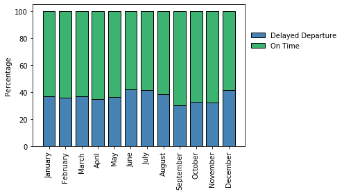

## Time Series Forecasting for Airline Flight Departure Delays Using Neural Networks

## Aim

The goal of this study is to predict particularly the length of time of future flight departure delays using standard recurrent neural network (RNN), long short-term memory (LSTM), and/or 1D-CNN-LSTM models.  The data was published by the Bureau of Transportation Statistics of the US Department of Transporation, and is available at: https://www.kaggle.com/yuanyuwendymu/airline-delay-and-cancellation-data-2009-2018.

## Exploratory Data Analysis

The dataset contains flight information from 2009 to 2018.

Figure 1.  Delayed and on-time flight departure distribution from 2009 to 2018.

Figure 2.  Delayed flight departure and arrival from 2009 to 2018.

Figure 3.  Type of delays and corresponding delayed departure time.

Figure 4.  Time of a day and corresponding delayed departure time.

Figure 5.  Delayed and on-time flight departure distribution during the months between 2009 and 2018.

Figure 6.  Delayed departure time during the months between 2009 and 2018.

Figure 7.  Delayed and on-time flight departure distribution for airline companies between 2009 and 2018.

Figure 8.  Delayed departure time for airline companies between 2009 and 2018.

Figure 9.  Delayed and on-time flight departure distribution in US States/Districts/Territories between 2009 and 2018.

Figure 10.  Delayed departure time in US States/Districts/Territories between 2009 and 2018.

Figure 11.  Correlation matrix of delayed flight departure information.

## Time Series

Figure 12.  Time series plot of delayed departure for Southwest Airlines.

Figure 12.  Time series plot of delayed departure for United Airlines.

## LSTM Model