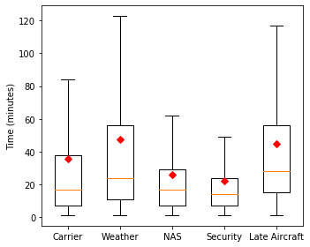

## Time Series Forecasting for Airline Flight Departure Delays Using Long Short Term Memory (LSTM) Neural Networks

## Overview

Air Traveling has been increasingly integrated into our daily life.  Like driving, it is essential to plan ahead and anticipate possible or imminent delays.  This study aims to predict future flight departure time delays using long short term memory (LSTM) neural network models.

## Methods

Figure 1.  Project workflow.

1. The Data

    Data extraction.  The data was published by the Bureau of Transportation Statistics of the US Department of Transporation, and is available at: https://www.kaggle.com/yuanyuwendymu/airline-delay-and-cancellation-data-2009-2018.  It is a large dataset consisting of over 60+ millions rows and 28 columns for US flight infromation from 2009 to 2018.

    Data cleaning and manipulation.  After careful evaulation, only revelant object and numerical type columns were kept.

1. Exploratory Data Analysis

    Plot distribution and feature correlations.
    

2. Modeling

    Recurrent neural network.  LSTM models were implmented using Tensorflow-Keras.  The representative summary of the neural network was shown on Table 1.  Models have different number of bidirectional layers and LSTM units.  Different optimizer learning rate and epochs were adjusted.

    Table 1.  A representative LSTM model summary.

    

    Figure 2.  A representative schematic of LSTM architecture.

    

3. Time Series

    The delayed departure time data was averaged monthly and split into train and test sets, 80:20.  A sliding window of previous 66 months were used to predict future 24 months.  Lag time = 1.  Mean absolute percentage error (MAPE) was calculated on test predictions.

## Exploratory Data Analysis

Figure 3.  Flight departure from 2009 to 2018.  (A) Delayed and on-time departure. (B) Delayed departure and arrival. (C) Histogram of delayed time.  (D) Averaged delayed time.

A)

B)

C, D)

Figure 4.  Delayed departure time.  (A) Type of delays.  NAS = National Aviation System.  (B) Time of a day.

A)

B)

Figure 5.  Flight departure during the months between 2009 and 2018.  (A) Delayed and on-time departure.  (B) Delayed departure time.

A)

B)

Figure 6.  Flight departure for airline companies between 2009 and 2018.  (A) Total number of flights for each airline.  (B) Delayed and on-time departure.  (C) Delayed departure time.

A)

B)

C)

Figure 7.  Flight departure in US States/Districts/Territories between 2009 and 2018.  (A) Delayed and on-time departure.  (B) Delayed departure time.

A)

B)

Figure 8.  Correlation matrix of delayed flight departure information.

## Time Series Forecasting

Time series forecast of flight time delays of indiviual airlines, in particularly Southwest and Alaska Airlines, and all airlines combined were examined.

Figure 9.  Time series plot of averaged monthly delayed departure time for all airlines.  (A) A Representative test prediction (crimson).  (B) Future prediction (light crimson).  n = 3, standard deviation with 95% confidence interval.

A)

B)

Figure 10.  Time series plot of averaged monthly delayed departure time for Southwest Airlines.  (A) A Representative test prediction (crimson).  (B) Future prediction (light crimson).  n = 3.

A)

B)

Figure 11.  Time series plot of averaged monthly delayed departure time for Alaska Airlines.  (A) A Representative test prediction (crimson).  (B) Future prediction (light crimson).  n = 3.

A)

B)

Table 2.  Time series test prediction result (n = 3).

## Summary
LSTM nerual network models were built to predict flight departure time delay in this study.  The univariate models consist of multiple bidirectional LSTM layers and have an overall performance of MAPE ranging from 10.0 ± 0.1% to 11.5 ± 0.8% on time series test predictions.  Future directions may consider multivariate LSTM models and develop a web application for the flight departure delay information using FLASK.

## Technologies

## Acknowledgements

I would like to thank L Belenky, S English, K Boerstler, and J Hall for their helpful discussion.

