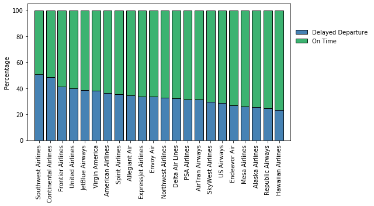

## Time Series Forecasting for Airline Flight Departure Delays Using Long Short Term Memory (LSTM) Neural Networks (To be updated soon)

## Aim

Air Traveling has been increasingly integrated into our daily life.  Like driving, it is essential to plan ahead and anticipate immient delays.  To achieve this, this study aims to is to predict future flight departure time delays using long short-term memory (LSTM) neural network models.  The data was published by the Bureau of Transportation Statistics of the US Department of Transporation, and is available at: https://www.kaggle.com/yuanyuwendymu/airline-delay-and-cancellation-data-2009-2018.

## Methods

1. Exploratory Data Analysis

    I. Extract data and identify features.

    II. Clean and manipulate data

    III. Plot distribution and determine correlations
    

2. Modeling

    Recurrent neural network.  LSTM models were implemnted using Tensorflow-Keras.  The representative summary of the neural network was shown on Table 1.  Models have different number of bidirectional layers and LSTM units.  Different optimizer learning rate and epochs were used to achieve best mean squared error (MSE) and mean absolute percentage error (MAPE).

3. Time Series
    The monthly dataset was split into train and test sets, 80:20.  A sliding window of previous 66 months were used to predict future 24 months.  Lag time = 1.

## Exploratory Data Analysis

The dataset contains total of 60+ million rows and 27 columns from 2009 to 2018.

Figure 1.  Flight departure from 2009 to 2018.  (A) Delayed and on-time departure. (B) Delayed departure and arrival. (C) Averaged delayed time.

A)

B)

C, D)

Figure.  Delayed departure time.  (A) Type of delays.  (B) Time of a day.

A)

B)

Figure.  Flight departure during the months between 2009 and 2018.  (A) Delayed and on-time departure.  (B) Delayed departure time.

A)

B)

Figure.  Flight departure for airline companies between 2009 and 2018.  (A) Total number of flights for each airline.  (B) Delayed and on-time departure.  (C) Delayed departure time.

A)

B)

C)

Figure.  Flight departure in US States/Districts/Territories between 2009 and 2018.  (A) Delayed and on-time departure.  (B) Delayed departure time.

A)

B)

Figure.  Correlation matrix of delayed flight departure information.

## LSTM Model

Table.  A representative LSTM model summary.

Figure.  A representative schematic of LSTM architecture.

## Time Series

Figure.  Time series plot of averaged monthly delayed departure time for all airlines.  (A) Representative test prediction (crimson).  (B) Future prediction (light crimson).  n = 3, standard deviation with 95% confidence interval.

A)

B)

Figure.  Time series plot of averaged monthly delayed departure time for Southwest Airlines.  (A) Representative test prediction (crimson).  (B) Future prediction (light crimson).  n = 3, standard deviation with 95% confidence interval.

A)

B)

Figure.  Time series plot of averaged monthly delayed departure time for Alaska Airlines.  (A) Representative test prediction (crimson).  (B) Future prediction (light crimson).  n = 3, standard deviation with 95% confidence interval.

A)

B)

## Next Steps

## Technologies

