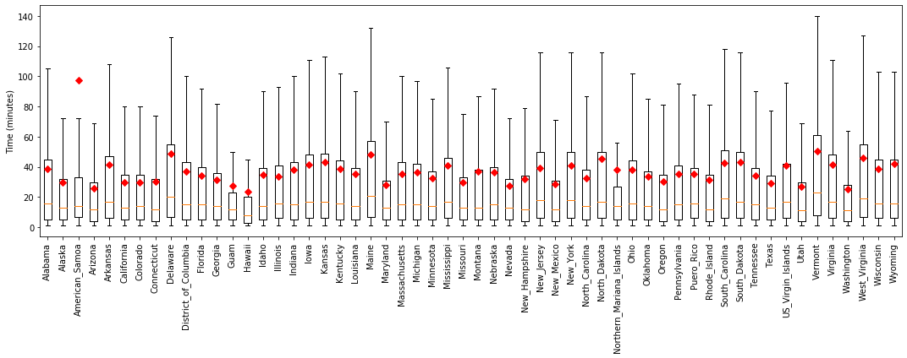

## Time Series Forecasting for Airline Flight Departure Delays Using Long Short Term Memory (LSTM) Neural Networks

## Aim

The goal of this study is to predict particularly the length of time of future flight departure delays using long short-term memory (LSTM) neural network models.  The data was published by the Bureau of Transportation Statistics of the US Department of Transporation, and is available at: https://www.kaggle.com/yuanyuwendymu/airline-delay-and-cancellation-data-2009-2018.

## Exploratory Data Analysis

The dataset contains flight information from 2009 to 2018.

Figure 1.  Flight departure from 2009 to 2018.  (A) Delayed and on-time departure. (B) Delayed departure and arrival.

A)

B)

Figure.  Delayed departure time.  (A) Type of delays.  (B) Time of a day.

A)

B)

Figure.  Flight departure during the months between 2009 and 2018.  (A) Delayed and on-time departure.  (B) Delayed departure time.

A)

B)

Figure.  Flight departure for airline companies between 2009 and 2018.  (A) Total number of flights for each airline.  (B) Delayed and on-time departure.  (C) Delayed departure time.

A)

B)

C)

Figure.  Flight departure in US States/Districts/Territories between 2009 and 2018.  (A) Delayed and on-time departure.  (B) Delayed departure time.

A)

B)

Figure.  Correlation matrix of delayed flight departure information.

## Time Series

Figure.  Time series plot of delayed departure for Southwest, United, and Alaska Airlines.

## LSTM Model