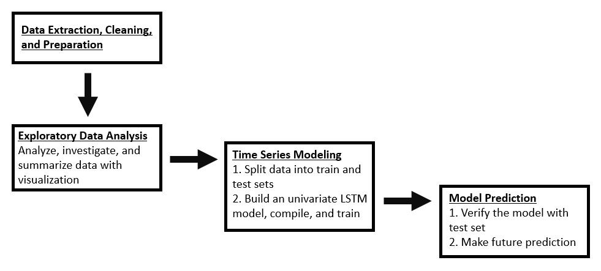
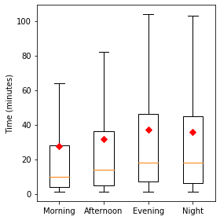
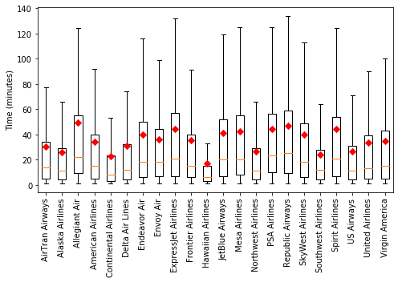
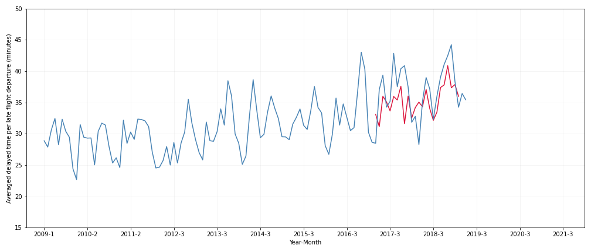
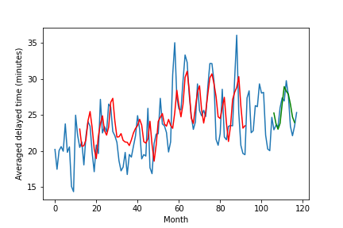
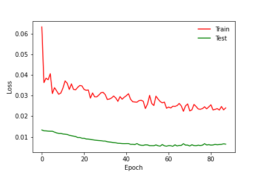

## Time Series Forecasting for Airline Flight Departure Delays Using Long Short Term Memory (LSTM) and Simple Recurrent Neural Networks (RNN)

## Overview

Air Traveling has been increasingly integrated into our daily life.  Like driving, it is essential to plan ahead and anticipate possible or imminent delays.  This study aims to predict flight departure time delays using long short term memory (LSTM) and simple recurrent neural network (RNN) models.

## Methods

**Figure 1**.  Project workflow.

**I. The Data**

Data extraction.  The data was published by the Bureau of Transportation Statistics of the US Department of Transporation, and is available at: https://www.kaggle.com/yuanyuwendymu/airline-delay-and-cancellation-data-2009-2018.  It is a large dataset consisting of over 60+ millions rows and 28 columns for US flight information from 2009 to 2018.

Data cleaning and preparation.  After careful consideration, only revelant object and numerical type columns were kept:
    
  1. FL_DATE (date of the flight)
  2. OP_CARRIER (airline identifier)
  3. ORIGIN (starting airport code)
  4. DEST (destination airport code)
  5. CRS_DEP_TIME (planned departure time)
  6. DEP_DELAY (total delay time on departure)
  7. ARR_DELAY (total delay time on arrival)
  8. AIR_TIME (time duration between wheels off and on time)
  9. DISTANCE (distance between two airports)
  10. CARRIER_DELAY (delay caused by the airline)
  11. WEATHER_DELAY (delay caused by the weather)
  12. NAS_DELAY (delay caused by the national aviation system (NAS))
  13. SECURITY_DELAY (delay caused by the security)
  14. LATE_AIRCRAFT_DELAY (delay caused by the late incoming aircraft)
    
Missing values in the DEP_DELAY column were systemically removed.  Missing values in the CARRIER_DELAY, WEATHER_DELAY, NAS_DELAY, SECURITY_DELAY, and LATE_AIRCRAFT_DELAY columns were replaced with -1.  The month, day, and year in the FL_DATE were extracted into separate columns.  The airline codes in the OP_CARRIER were replaced with its airline name.  The codes in the ORGIN and DEST columns were replaced with its airport location name (US state, district, or territory name).  The time in the CRS_DEP_TIME column was categorized into morning (from 6am to 11:59am), afternoon (from 12pm to 4:59pm), evening (from 5pm to 7:59pm), and night (from 8pm to 5:59am).  Data with total delay time on departure less than or equal 0 min was filtered out.  Outliers for delay departure time was kept, but not shown in the graphs.

**II. Exploratory Data Analysis**

Data Exploration.  Investigate and summarize the dataset by generating bar graphs, boxplots, histograms, and pie charts.
    

**III. Modeling**

Recurrent neural networks.  LSTM models were implmented using Tensorflow-Keras.  The representative summary of the neural network and its architecure was shown on Table 1 and Figure 2, respectively.  Models have different number of bidirectional layers and LSTM units.  Different optimizer learning rate and epochs were adjusted.  Models were run on an Amazon EC2 instance (type: g4dn.2xlarge).

**Table 1**.  A representative LSTM model summary.

**Figure 2**.  A representative schematic of LSTM architecture.

**IV. Time Series**

The delay departure time data was averaged monthly and split into train and test sets, 80:20.  A sliding window of previous 66 months were used to predict future 24 months.  Mean absolute percentage error (MAPE) was calculated for test predictions.

## Exploratory Data Analysis

There were 36.8% of flights that departed late between 2009 and 2018.  And among those, 72.3% resulted in late arrival to their desintation (Fig. 3).  There were many causes of delay including carrier, weather, NAS, security, and late aircraft delays (Fig. 4a), and the time of a day (Fig. 4b).  Delay departure time may also be affected by the months of a year (Fig. 5), airline companies (Fig. 6), and aiport locations (Fig. 7).  The correlation matrix shows a strong correlation between the departure delay and arrival delay, followed by carrier delay and late aircraft delay (Fig. 8).

**Figure 3**.  Flight departure from 2009 to 2018.  (A) Delayed and on-time departure. (B) Delayed departure and arrival. (C) Histogram of delayed time.  (D) Averaged delayed time.

A)

B)

C, D)

**Figure 4**.  Delayed departure time.  (A) Type of delays.  NAS = National Aviation System.  (B) Time of a day.

A)

B)

**Figure 5**.  Flight departure during the months between 2009 and 2018.  (A) Delayed and on-time departure.  (B) Delayed departure time.

A)

B)

**Figure 6**.  Flight departure for airline companies between 2009 and 2018.  (A) Total number of flights for each airline.  (B) Delayed and on-time departure.  (C) Delayed departure time.

A)

B)

C)

**Figure 7**.  Flight departure in US States/Districts/Territories between 2009 and 2018.  (A) Delayed and on-time departure.  (B) Delayed departure time.

A)

B)

**Figure 8**.  Correlation matrix of delayed flight departure information.

## Time Series Forecasting

Time series forecast of flight time delays of indiviual airlines, in particularly Southwest (Fig. 10) and Alaska Airlines (Fig. 11), and all airlines combined (Fig. 9) were examined.  It is based on the univariate LSTM models.  Southwest Airlines were selected because it has the highest number of flights between 2009 and 2018, whereas Alaska Airlines was among the lower ends.  The averaged MAPE was determined for each airline (Table 2).

**Figure 9**.  Time series plot of averaged monthly delayed departure time for all airlines.  (A) A Representative test prediction (crimson).  (B) Future prediction (light crimson).  n = 3, standard deviation with 95% confidence interval.

A)

B)

**Figure 10**.  Time series plot of averaged monthly delayed departure time for the Southwest Airlines.  (A) A Representative test prediction (crimson).  (B) Future prediction (light crimson).  n = 3.

A)

B)

**Figure 11**.  Time series plot of averaged monthly delayed departure time for the Alaska Airlines.  (A) A Representative test prediction (crimson).  (B) Future prediction (light crimson).  n = 3.

A)

B)

**Table 2**.  Time series test prediction result (n = 3).

## Conclusion and Future Implementation
LSTM nerual network models were built to predict flight departure time delay in this study.  The univariate models consist of multiple bidirectional LSTM layers and have an overall performance of MAPE ranging from 10.0 ± 0.1% to 11.5 ± 0.8% on time series test predictions.  Future directions may consider multivariate LSTM models and possibly develop a web application to access flight departure delay information.

## Technologies

## Acknowledgements

I would like to thank L Belenky, S English, K Boerstler, and J Hall for their helpful discussion.  Thank you.

## Addendum

This version is a simplified bidirectional univariate model with reduced layers and units that predicts the immediate month.  The model was built with a combination of a single LSTM layer followed by two simple-RNN layers.  The data was standardized.  The model gives a lower mean absolute percentage error of 5.6 ± 0.1% (n = 5) than the original version.

**Supplementary Figure 1**.  Representative time series univariate plot of averaged monthly delayed departure time for Southwest Airlines.  Train/test split: 80:20; look back (lag time) = 12; sliding window step = 1; red color = train prediction; green color = test prediction.

**Supplementary Figure 2**.  Representative graph of loss function of train and test sets for the univariate model.

Univariate Model (n = 5):

Train RMSE: 3.135 ± 0.025

Train MAPE: 10.9 ± 0.1%

Test RMSE: 1.650 ± 0.079

Test MAPE: 5.6 ± 0.1%

A multivariate model was constructed.  The model architecture was the same as the new version of univariate model; however, with addition of CARRIER_DELAY and LATE_AIRCRAFT_DELAY features.  WEATHER_DELAY, NAS_DELAY, and SECURITY_DELAY features were not included because addition of those features would cause an increase in MAPE.  The data was standardized.  Overall, MAPE (4.9 ± 0.2% (n = 5)) of the multivariate model is significantly lower than that of the univariate model; thus indicating that the multivariate model is the best performing model in this study.

**Supplementary Figure 3**.  Representative time series mulitvariate plot of averaged monthly delayed departure time for the Southwest Airlines.  Train/test split: 80:20; look back (lag time) = 12; sliding window step = 1; red color = train prediction; green color = test prediction.

**Supplementary Figure 4**.  Representative graph of loss function of train and test sets for the multivariate model.

Multivariate Model (n = 5):

Train RMSE: 2.903 ± 0.090

Train MAPE: 10.1 ± 0.4%

Test RMSE: 1.540 ± 0.047

Test MAPE: 4.9 ± 0.2%

**Supplementary Figure 5**.  The MAPE of mulitvariate model is significantly lower (p-value = 0.00132) than that of the univariate model.  Test set. MAPE, %.

